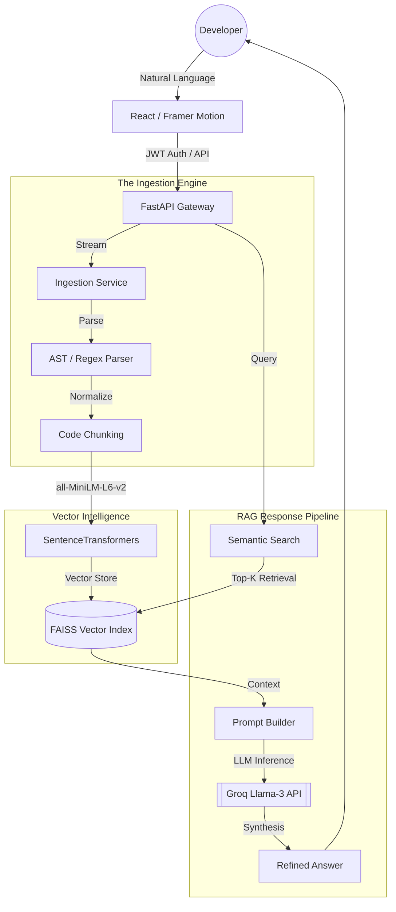

# CodeAI 🧠 

[](https://opensource.org/licenses/MIT)
[](https://fastapi.tiangolo.com/)
[](https://reactjs.org/)
[](https://groq.com/)

**CodeAI** is a production-grade, AI-native developer tool designed to transform how you interact with complex codebases. By combining Retrieval-Augmented Generation (RAG) with deep static analysis, CodeAI allows you to query any GitHub repository or local ZIP archive using natural language, providing context-aware answers, architectural insights, and dependency visualizations.

---

## 🛠️ Technology Stack

| Layer | Technologies |
| :--- | :--- |
| **Frontend** | React 18, Vite, Framer Motion, Lucide Icons, Zustand |
| **Backend** | FastAPI (Python 3.10+), Uvicorn |
| **AI / NLP** | Groq (Llama-3.3-70B), SentenceTransformers (`all-MiniLM-L6-v2`) |
| **Vector DB** | FAISS (Facebook AI Similarity Search) |
| **Security** | JWT (JSON Web Tokens), Bcrypt Hashing |
| **Storage** | File-based JSON Storage (Zero DB dependency) |

---

## 📂 Project Structure

```text
askyourcodebase/
├── backend/
│   ├── app/
│   │   ├── api/          # Route handlers (Auth, Repos, Chat)
│   │   ├── core/         # Security, Configuration, Storage logic
│   │   ├── schemas/      # Pydantic data models
│   │   ├── services/     # Ingestion, RAG Pipeline, Static Analysis
│   │   └── main.py       # FastAPI Entry Point
│   ├── data/             # Persistent FAISS indexes and Metadata
│   └── requirements.txt  # Python Dependencies
└── frontend/
    ├── src/
    │   ├── components/   # Modular UI components
    │   ├── pages/        # Application views (Login, Register)
    │   ├── store/        # Zustand Global State Management
    │   ├── api.js        # Axios instance with Auth Interceptor
    │   └── index.css     # Premium Design System
    └── package.json      # Node.js Dependencies
```

---

## 🚀 Core Capabilities

### 🧠 Intelligence & RAG
- **Semantic Code Search**: Utilizes `SentenceTransformers` and `FAISS` for high-precision vector search across your functions, classes, and logic.
- **Context-Grounded Answers**: Powered by **Groq Llama-3.3-70B**, delivering lightning-fast, accurate responses grounded strictly in your source code.
- **Query Optimization**: Automatic LLM-powered query rewriting to improve retrieval accuracy.
- **Source Referencing**: Clickable, line-specific code references for every AI response.

### 🔍 Deep Analysis
- **Architecture Synthesis**: AI-generated high-level overviews of codebase structure and design patterns.
- **Static Analysis**: Automated scanning for code smells, security vulnerabilities, and technical debt.
- **Dependency Mapping**: Interactive SVG-based module dependency graphs for Python projects.

### 🔒 Enterprise-Grade Security
- **Multi-Tenant Isolation**: Complete data separation. Users only see and interact with repositories they have personally uploaded.
- **JWT Authentication**: Secure session management using industry-standard JSON Web Tokens with `bcrypt` password hashing.
- **Private local storage**: File-based JSON storage ensures no external database dependency while maintaining persistent user states.

---

## 🏗️ Technical Architecture



---

## 🛠️ Quick Start

### 1. Prerequisites
- Python 3.10+
- Node.js 18+
- [Groq API Key](https://console.groq.com)

### 2. Backend Setup
```bash
cd backend

# Configure environment
cp .env.example .env
# Edit .env: Add GROQ_API_KEY=gsk_...

# Initialize virtual environment
python -m venv venv
source venv/bin/activate  # Linux/Mac
# venv\Scripts\activate   # Windows

# Install and Run
pip install -r requirements.txt
uvicorn app.main:app --reload --port 8000
```

### 3. Frontend Setup
```bash
cd frontend

# Install dependencies
npm install

# Start development server
npm run dev
```

---

## 📂 Project Structure

| Directory | Description |
| :--- | :--- |
| `backend/app/api` | REST API endpoints (Auth, Repos, Chat) |
| `backend/app/services` | Core logic for Ingestion, Embedding, and RAG |
| `backend/app/core` | Security middleware, Storage logic, and Configuration |
| `frontend/src/components` | Premium UI components (ChatPanel, CodePanel, Sidebar) |
| `frontend/src/store` | Global state management using Zustand |
| `data/` | Persistence layer for FAISS indexes and JSON metadata |

---

## ⚙️ Environment Configuration

Edit `backend/.env` to customize your instance:

| Variable | Default | Purpose |
| :--- | :--- | :--- |
| `GROQ_API_KEY` | - | **Required** for AI inference |
| `EMBEDDING_MODEL` | `all-MiniLM-L6-v2` | Local model for vectorizing code |
| `MAX_REPO_SIZE_MB` | `500` | Safety limit for file uploads |
| `GITHUB_TOKEN` | - | Optional: Access private repositories |

---

## ⚖️ License

Distributed under the MIT License. See `LICENSE` for more information.

---